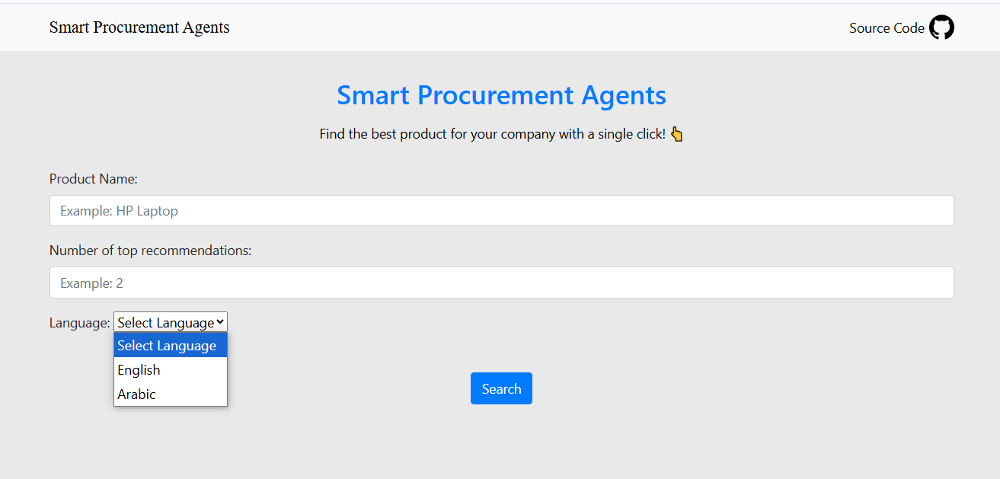

# smart-procurement-agents
This is a smart procurement agents that can help you to find the best product for your company. and generate a report for you.

## Screenshots


## Features
- Find the best product for your company
- Generate a report for you 

## Requirements
- Python 3.11

### Install Python Using Miniconda
1- Download and install MiniConda from [here](https://www.anaconda.com/docs/getting-started/miniconda/main#quick-command-line-install)

2- Create a new environment using the following command:
```bash
$ conda create --name smart-procurement-agents python=3.11 -y
```

3- Activate the environment:
```bash
$ conda activate smart-procurement-agents
```

### Installation

#### Install the required packages
```bash
$ pip install -r requirements.txt
```

### Setup the environment variables
```bash
$ cp .env.example .env
```
Set your environment variables in the .env file. Like:
OPEN_ROUTER_API_KEY value to use LLM
Agentops_API_KEY value to monitor the agents
TVLY_SEARCH_API_KEY value to search the web

You can get your Open Router API key from [here](https://openrouter.ai/settings/keys).
You can get your Agentops API key from [here](https://agentops.com/).
You can get your TVLY_SEARCH_API_KEY from [here](https://tavily.ai/).

## Run the application:
```bash
$ python app.py
```

## Access the application
Open your browser and navigate to `http://127.0.0.1:5000`.

To stop the application, press `Ctrl+C` in your terminal.

## License
This project is licensed under the MIT License. See the [LICENSE](./LICENSE) file for details.